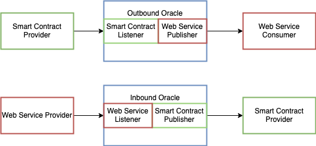

# Introduction

In the following you will get to know, what you can do with this software.

## Workflow Automation

To automate profession or private tasks some people like to write computer programs. No everyone is able to code, so companies created no-code workflow automation platforms, like [Zapier](https://www.zapier.com), [n8n](https://www.n8n.io) or [IFTTT](https://www.ifttt.com). These platforms let you combine services like Google Spreadsheets, Spotify, mail programs or messengers services, to automate your tasks in so called workflows.

These workflows propagate data from triggers, that provide the data, through brokers, to data consumers as shown in the picture below. 

## Smart Contracts

Smart contracts software programs that are deployed to blockchains. You can think of them like regular computer programs. They face one challenge, they cannot communicate on their own to other computer programs, that are not deployed to their blockchain (off-chain). This means, integrating them into workflow automation is difficult. But other computer programs, called oracles, can create a bridge between smart contract and off-chain programs. There are two kind of oracles that are particularly interesting to us. Push-based inbound oracles and push-based outbound oracles, which I will call for simplicity just inbound and outbound from now on. 

Inbound Oracles receive some data from an off-chain program and will forward this data to a smart contract, as displayed in the graphic below.

Outbound Oracle go the other way they listen to events created from smart-contracts and will forward the data to an off-chain program, also shown in the graphic below.

You can see, that the oracle always contains a listener and a publisher. If we want to use a smart contract as a provider we need to create an outbound oracle. If the smart contract should be a consumer, we create an inbound oracle.

## The Software
The software you will test will try to let no-coders create these oracles, so no-coders can integrate smart contracts into their workflows.

## The Tasks

We ask you to do some tasks. Before starting please open [our tool](https://oracles.work)

1. Create an account and connect it to the Ethereum
blockchain with the following credentials:
    * Ethereum Private Key: 0x34567ab1289efb761298732.
    * Ethereum Gateway: https://infura.com/hfjdksafehuka
2. Create a smart contract listener for the
given smart contract event.
3. Create a smart contract publisher for
the given smart method.
4. Create a web service listener for
the given name.
5. Create a web service publisher with
the given name and URL.
6. Create an outbound oracle with the smart
contract listener created in step 2 and web service
publisher created in step 5.
7. Create an inbound oracle with the web service
listener created in step 3 and smart
contract publisher created in step 4.